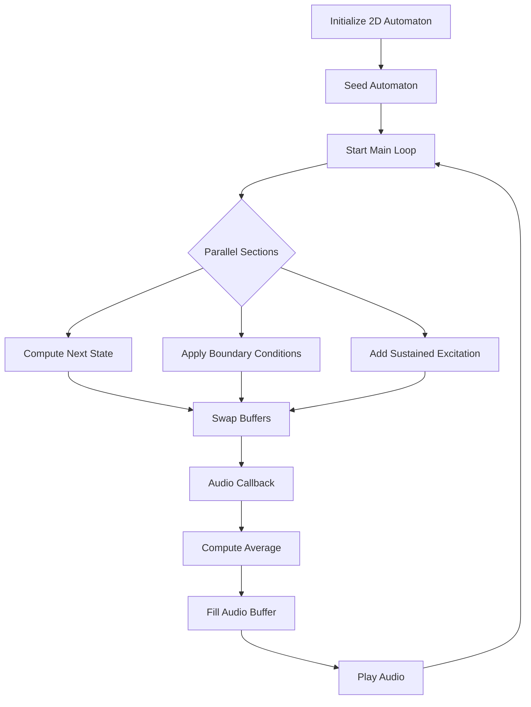

# lattice

This project is an experimental exploration of mapping a 2D automaton's state to audio in real-time.

## Overview

The program initializes a 2D automaton of a specified width and height, seeds it with initial data, and then computes its state in a loop. The state of the automaton is then used to stream audio using a callback mechanism.

### Workflow

1. **Initialization**:
   - Initialize a 2D automaton grid.
   - Seed the automaton with a pulse of data.

2. **Main Loop**:
   - In parallel:
     - Compute the next state of the automaton.
     - Apply boundary conditions.
     - Add any sustained excitations.
   - After computation, swap the read and write buffers.

3. **Audio Streaming**:
   - An audio callback function reads the current state of the automaton.
   - The callback calculates an average from a small domain of the state.
   - This average is then used to fill an audio buffer which is played back in real-time.

### Double Buffering

To avoid race conditions between the audio callback (which reads the automaton's state) and the main loop (which updates it), a double buffering approach is used. There are two state buffers:
- `readState`: The buffer being read by the audio callback.
- `writeState`: The buffer into which the automaton's next state is written.

After each iteration of the main loop, these buffers are swapped. This ensures that the audio callback always has a consistent state to read from, even while the next state is being computed.

## Code Structure

- `main.cpp`: Contains the main program logic, including the automaton initialization, the main loop, and the audio streaming setup.
- `audio_handler.cpp`: Contains the audio callback function which reads the automaton's state and fills the audio buffer.

## Diagram

## GRAPHICS LIBRARY GOALS & REQUIREMENTS

GOAL:
- Develop a high-performance graphics library that facilitates efficient
  visualization of a 2D automaton and its subsequent states in real-time.

CORE REQUIREMENTS:

1. Cross-platform: The library should work seamlessly across major platforms,
   especially macOS M1.

2. High Performance: Capable of rendering large datasets in real-time with minimal
   latency.

3. Thread-safe: Able to work concurrently with other threads, especially with audio
   and automaton computation threads.

4. Minimal Dependencies: Reduce dependency on extensive frameworks or libraries,
   especially GUI-related ones.

5. Modular: Should be easy to integrate with other parts of the system, like audio
   processing or automaton computation.

6. User-friendly API: The API should abstract away the complexities of Vulkan and
   provide an intuitive interface for common tasks.

7. Buffering: Integrate a mechanism to buffer several computations and update the 
   visualization at a fixed rate, e.g., 60Hz.

