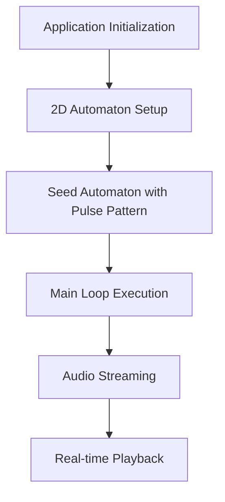
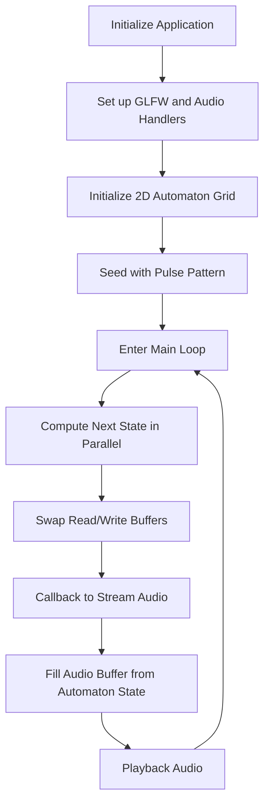

"""
# lattice

Sound Generation via Physics-Inspired Cellular Automata

Generating sound through simulations of real-world physics, especially the intricate dynamics of pressure wave propagation, presents computational challenges. For a better grasp on this, consider the following:
- AngeTheGreat's real-time demonstration of physics-based audio: [Real-time Trumpet Simulation [C++/Vulkan]](https://youtu.be/rGNUHigqUBM?t=119).
- Doug James elaborating on the intricacies of physics-based sound generation: [Doug James: Computer-generated sound catches its graphical sibling](https://youtu.be/10zK-3SjTeY?t=479).

To address these challenges, we can beging with an understanding of the capabilities of current hardware (CPUs and GPUs), and identify the kind of physics simulations they can efficiently handle. This is where Cellular automata come into the picture. Defined on a grid and driven by simple, localized rules, they are known to produce intricate dynamics. Given their structure, they can be computed rapidly on contemporary hardware, which makes them a potential tool for simulating real-world physics. A notable example in this context is the [Lattice gas automaton](https://en.wikipedia.org/wiki/Lattice_gas_automaton).

## Technical Overview

The application initializes a 2D automaton grid of specified dimensions, populates it with an initial state, and then continuously computes its subsequent states. The automaton's state serves as a data source for audio streaming via a callback mechanism.

### High-Level Workflow

### Detailed Workflow

Diagram

## Code Structure

The main constituents and directory structure of the project are:

- **Root Directory**:
    - `CMakeLists.txt`: The primary configuration file for CMake.
    - `build.sh`: A handy script for project compilation.
    - `README.md`: A comprehensive guide and overview (this document).

- **Audio Processing**:
    - Resides in the `audio` directory.
    - Hosts classes and functionalities tied to audio processing and streaming.

- **Automaton Simulation**:
    - Found inside the `src` directory.
    - The core simulation logic is encapsulated in `automaton_2d.cpp` and `SimulationWorker.cpp`.

- **Resources and Third-party Libraries**:
    - `resources`: A repository for asset files utilized in the simulation.
    - `external`: A directory for external headers and libraries.
    - `webgpu`: Houses files and configurations related to WebGPU.

## Compilation and Execution

Please consult the provided `build.sh` script for detailed build instructions. The current version is tailored for macOS, but there are plans to extend support to other platforms.
"""
