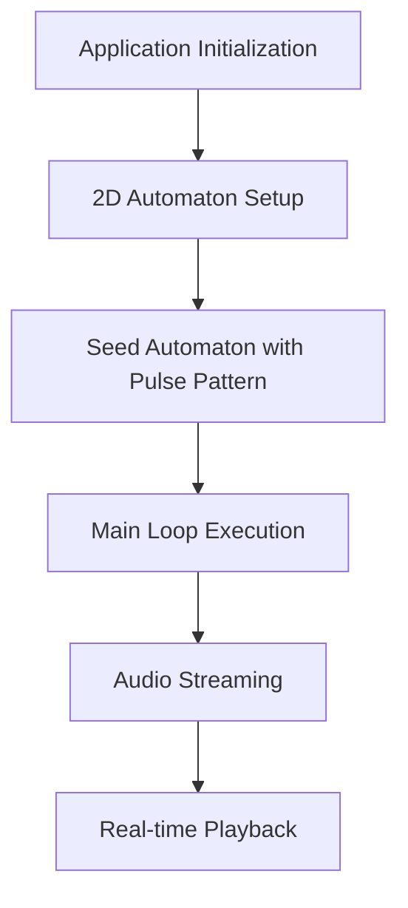
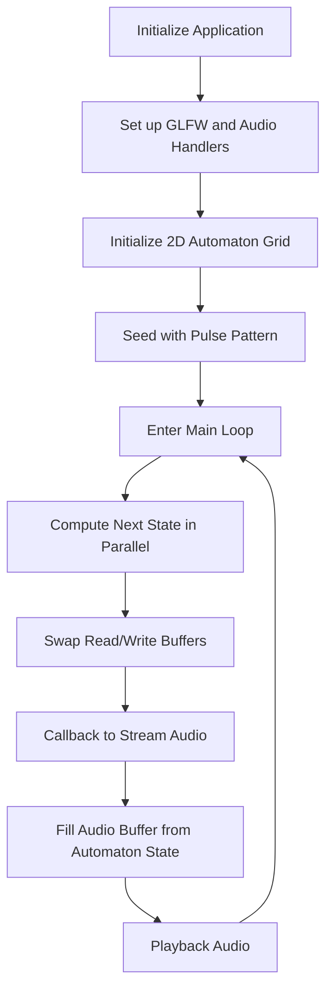

# lattice

Sound Generation via Physics-Inspired Cellular Automata

Simulating the intricate real-world physics of pressure wave propagation is challenging. For insights, consider:
- AngeTheGreat's demonstration on real-time physics-based audio: [Real-time Trumpet Simulation [C++/Vulkan]](https://youtu.be/rGNUHigqUBM?t=119).
- Doug James discussing the complexities of physics-based audio: [Doug James: Computer-generated sound catches its graphical sibling](https://youtu.be/10zK-3SjTeY?t=479).

Addressing this challenge requires rethinking our approach. Starting with hardware (CPUs and GPUs), we must identify which physics simulations are most computationally efficient. Cellular automata emerge as a promising solution. Defined on a grid and driven by straightforward rules, they yield complex dynamics. Their structure allows rapid computation on contemporary hardware, making them suitable for simulating real-world physics, as seen in [Lattice gas automaton](https://en.wikipedia.org/wiki/Lattice_gas_automaton).

## Technical Overview

The program initializes a 2D automaton of a specified width and height, seeds it with initial data, and then computes its state in a loop. The state of the automaton is then used to stream audio using a callback mechanism.

### High-Level Workflow

### Detailed Workflow

Diagram

## Code Structure

The project's directory structure and main components are as follows:

- **Root Directory**:
    - `CMakeLists.txt`: Main CMake configuration file.
    - `build.sh`: Script for building the project.
    - `README.md`: Overview and instructions (this file).

- **Audio Handling**:
    - Located inside the `audio` directory.
    - Contains classes and functions related to processing and streaming audio.

- **Automaton Computation**:
    - Located inside the `src` directory.
    - Files `automaton_2d.cpp` and `simulationworker.cpp` handle the simulation logic.

- **Resources and External Libraries**:
    - `resources`: Contains asset files used in the simulation.
    - `external`: External header files and libraries.
    - `webgpu`: WebGPU related files and configuration.

## Building and Running

Please refer to the provided `build.sh` script for building instructions. The project is currently optimized for macOS but I'm planning on making it fully cross-platform.
"""
